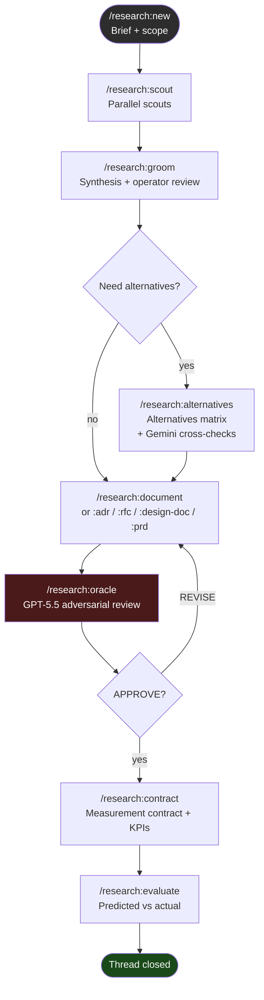

# pi-deep-research

A [pi coding agent](https://pi.dev) extension for structured research workflows: parallel scouts → meta-cognitive synthesis → alternatives matrix → cross-family oracle review → ADR / RFC / Design Doc / PRD with KPI contracts.

---

## Workflow



**Default scout roster** (no config needed):

| Scout | Model | Requires |
|---|---|---|
| Web — vendor docs, blogs, talks | `claude-haiku-4-5` | `EXA_API_KEY` (degrades gracefully without) |
| OSS — GitHub production code | `claude-haiku-4-5` | `gh` CLI |
| Repo — your own codebase | `claude-sonnet-4-6` | `git` |
| Memory — prior decisions *(opt-in)* | `claude-haiku-4-5` | `MEMPALACE_URL` in config |

---

## Prerequisites

### API keys

```bash
# Tier 1 — scouts + synthesis (Anthropic)
export ANTHROPIC_API_KEY=sk-ant-...

# Tier 2 — cross-checks (Google Gemini)
export GEMINI_API_KEY=...        # from aistudio.google.com

# Tier 3 — oracle review (OpenAI)
export OPENAI_API_KEY=sk-...
```

> **Anthropic-only setup:** scouts and synthesis work with only `ANTHROPIC_API_KEY`. Gemini cross-checks and GPT oracle fall back gracefully or prompt you to confirm a fallback model.

### pi extensions

```bash
npm install -g @earendil-works/pi-coding-agent

pi install npm:pi-subagents    # required — oracle + cross-checks run as subagents
```

### MCP servers (optional but recommended)

Add to `~/.pi/agent/mcp.json`:

```json
{
  "mcpServers": {
    "exa": {
      "command": "npx",
      "args": ["-y", "exa-mcp-server", "tools=web_search_exa,get_code_context_exa"]
    },
    "context7": {
      "type": "streamable-http",
      "url": "https://mcp.context7.com/mcp"
    }
  }
}
```

---

## Install

```bash
# From GitHub
pi install git:github.com/ruslan-kurchenko/pi-deep-research

# Try without installing first
pi -e git:github.com/ruslan-kurchenko/pi-deep-research

# Project-local (shared with team via .pi/settings.json)
pi install -l git:github.com/ruslan-kurchenko/pi-deep-research
```

Agent profiles are installed automatically to `~/.pi/agent/agents/` on first load.

### Verify setup

```
/research:doctor           # quick check: config, credentials, writable dirs
/research:doctor --deep    # also probes scout availability and MCP tools
/research:doctor --json    # machine-readable; exit 0=ok 1=warn 2=error
```

---

## Quick start

```
cd ~/Projects/my-project
pi

/research:new Should we migrate from REST to GraphQL?
/research:scout
/research:groom
/research:design-doc
/research:oracle
/research:contract
```

---

## All commands

| Command | Phase | What it does |
|---|---|---|
| `/research:new <topic>` | → brief | Create thread, grill-me interview, write `brief.md` |
| `/research:scout [paths…]` | brief → scout | Dispatch 3–4 parallel scouts; write raw findings |
| `/research:groom` | scout → groom | Meta-cognitive synthesis → `synthesis.md`; operator review |
| `/research:alternatives` | groom → alternatives | Scored matrix + Gemini challenger + devil's advocate |
| `/research:document` | groom+ → docs | Smart router: recommends ADR / RFC / Design Doc / PRD |
| `/research:adr [title]` | groom+ → docs | Architecture Decision Record |
| `/research:rfc` | groom+ → docs | Multi-decision RFC |
| `/research:design-doc` | groom+ → docs | Design Doc with C4 diagrams |
| `/research:prd` | docs → docs | PRD citing linked ADR/RFC/Design Doc |
| `/research:oracle [gate]` | alternatives+ | GPT-5.5 cross-family adversarial review |
| `/research:contract` | docs → contract | Measurement contract: KPIs, rollback criteria, sample size |
| `/research:evaluate` | contract → evaluate | Predicted vs actual; writes evaluation report |
| `/research:doctor [--deep] [--json]` | any | Preflight check — config, credentials, scout availability |
| `/research:status` | any | List all threads and phases |
| `/research:resume <id>` | any | Switch active thread |

> **Phase guards:** commands check the current thread phase and warn or confirm before running out of order. Pass `/research:scout src/commands src/scouts` to focus the repo scout on specific paths.

---

## Directory layout

```
research/                          ← gitignored (raw working artifacts)
  001-why-graphql/
    brief.md
    .state.json                    ← phase, model audit log, oracle reviews
    raw/
      web-001-web.md
      oss-001-oss.md
      repo-001-repo.md
    synthesis.md
    alternatives.md
    cross-checks/
      challenger.md                ← Gemini
      devils-advocate.md           ← Gemini
    oracle/
      after-alternatives.md
      after-doc.md

docs/                              ← committed (final artifacts)
  decisions/adrs/001-*.md
  rfcs/001-*.md
  design-docs/001-*.md
  prds/001-*.md
  measurement/001-*.md
  evaluation/001-*.md

.pi/deep-research/
  active.json                      ← active thread pointer (project-scoped)
  config.json                      ← optional project config (see below)
```

---

## Config

Create `.pi/deep-research/config.json` in your project root:

```json
{
  "user": {
    "name": "Your Name"
  },
  "mempalaceUrl": "https://your-mempalace.example.com",
  "models": {
    "research-oracle": "gpt-5.5",
    "research-challenger": "gemini-2.5-pro"
  },
  "scouts": [
    "examples/github-trends/index.js"
  ],
  "allowExternalScouts": false
}
```

| Field | Default | Description |
|---|---|---|
| `user.name` | `git config user.name` | Author name in generated ADRs/RFCs/Design Docs |
| `mempalaceUrl` | `undefined` | Enables memory scout and post-evaluate save to MemPalace |
| `models` | see below | Override model per agent (native pi IDs) |
| `scouts` | `[]` | Additional scout modules (built-in id or path to compiled `.js`) |
| `allowExternalScouts` | `false` | Allow scout paths outside `projectRoot/scouts` or `projectRoot/examples` |

### Default models

| Agent | Default model | Role |
|---|---|---|
| `research-web-scout` | `claude-haiku-4-5` | Web research |
| `research-oss-scout` | `claude-haiku-4-5` | GitHub OSS recon |
| `research-repo-scout` | `claude-sonnet-4-6` | Codebase recon |
| `research-memory-scout` | `claude-haiku-4-5` | MemPalace retrieval |
| `research-synthesizer` | `claude-sonnet-4-6` | Meta-cognitive synthesis |
| `research-challenger` | `gemini-2.5-pro` | Adversarial cross-check |
| `research-devils-advocate` | `gemini-2.5-pro` | Adversarial cross-check |
| `research-kpi-architect` | `claude-sonnet-4-6` | Measurement contract |
| `research-oracle` | `gpt-5.5` | Final review |

---

## Custom scouts

Scouts are TypeScript modules that implement `ScoutDefinition` and export it as `default`. They must be compiled to `.js` before use.

```typescript
// my-scouts/jira-scout.ts
import type { ScoutDefinition } from 'pi-deep-research/src/scouts/types.js';
import { SCOUT_API_VERSION } from 'pi-deep-research/src/scouts/types.js';

const jiraScout: ScoutDefinition = {
  scoutApiVersion: SCOUT_API_VERSION,  // must be 1
  version: '1.0.0',
  id: 'jira',
  label: 'Jira',
  description: 'Fetches related Jira tickets and prior spike notes',
  mcpTools: [],
  cliBinaries: [],
  envVars: ['JIRA_API_TOKEN', 'JIRA_BASE_URL'],
  unavailableReason: 'JIRA_API_TOKEN or JIRA_BASE_URL not set',
  agentProfile: new URL('./agent.md', import.meta.url).pathname,
  promptTemplate: new URL('./prompt.md', import.meta.url).pathname,
  promptVariables: ['brief'],
  defaultModel: 'claude-haiku-4-5',
  agentName: 'my-jira-scout',
  outputFilePattern: 'jira-{n}-{threadId}.md',
  requiredOutputSections: ['## Related tickets'],
  async isAvailable() {
    return Boolean(process.env.JIRA_API_TOKEN && process.env.JIRA_BASE_URL);
  },
};

export default jiraScout;
```

Compile and register:

```bash
tsc my-scouts/jira-scout.ts --outDir my-scouts/dist
```

```json
// .pi/deep-research/config.json
{
  "scouts": ["my-scouts/dist/jira-scout.js"]
}
```

See `examples/memory-mempalace/` and `examples/github-trends/` for full working examples.

**Trust model:** scouts outside `projectRoot/scouts/` or `projectRoot/examples/` require `allowExternalScouts: true`. v1 protects against accidental execution, not malice. Treat `config.scouts[]` entries like `package.json` dependencies — only add code you trust.

---

## For agents using this extension

If you are an AI agent operating inside pi with this extension loaded:

**Starting a research thread:**
```
/research:new <topic>
```
The extension will prompt for scope (architecture / feature / module / nfr / combined) then create `research/<thread-id>/brief.md` and set the active thread.

**Running the workflow:**
```
/research:scout          # dispatch parallel scouts; wait for all to complete
/research:groom          # synthesize; review synthesis.md before proceeding
/research:design-doc     # generate the doc; oracle review follows
/research:oracle         # APPROVE/REVISE loop; accept all concerns to re-run
/research:contract       # KPI contract; required before evaluate
```

**Checking state:**
```
/research:status         # shows all threads, phases, linked docs
/research:doctor         # verifies config and credentials before starting
```

**Thread state is in** `research/<thread-id>/.state.json` — contains `phase`, `linkedDocs`, `oracleReviews`, and `modelUsage` audit log.

**Phase order:** `brief → scout → groom → alternatives → docs → contract → evaluate → closed`

Commands check the current phase and block or confirm-rerun if out of order.

---

## License

MIT
